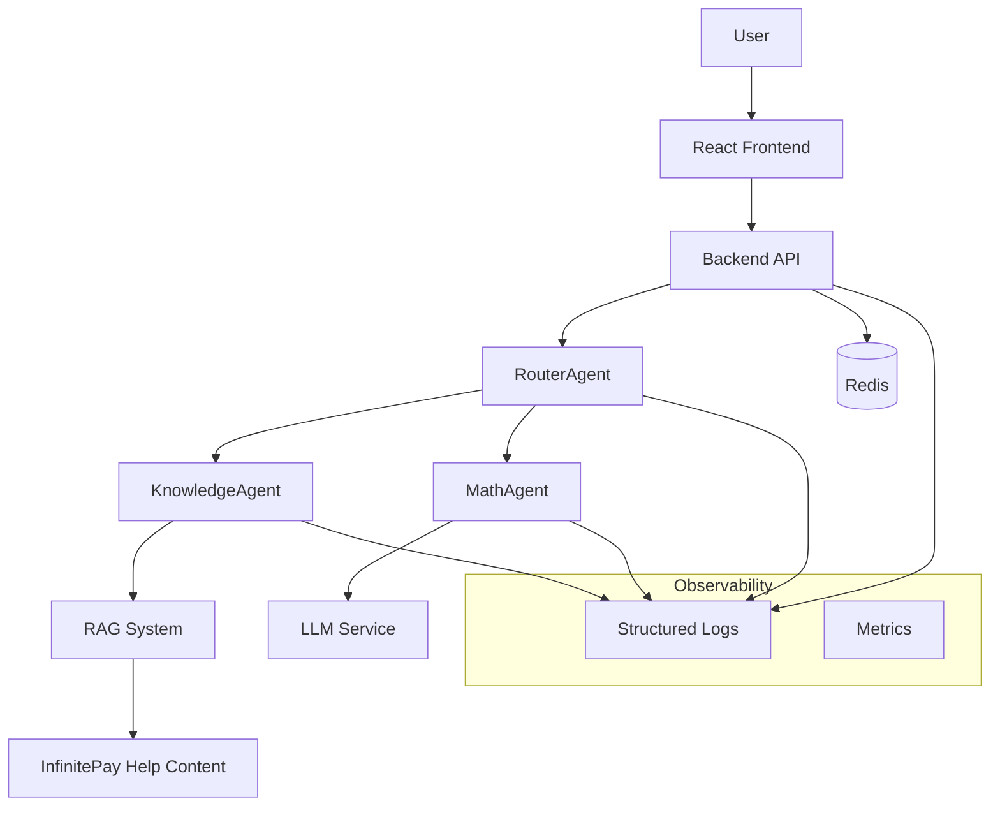

# Design Document

## Overview

The Modular Chatbot system is designed as a microservices-based architecture that demonstrates modern software engineering practices. The system consists of a React frontend, a Python/Node.js backend with specialized agents, Redis for state management, and comprehensive observability features. The architecture emphasizes modularity, security, and maintainability while providing intelligent routing between specialized AI agents.

## Architecture

### High-Level Architecture



### Component Architecture

The system follows a layered architecture with clear separation of concerns:

1. **Presentation Layer**: React frontend for user interaction
2. **API Layer**: RESTful API handling HTTP requests and responses
3. **Business Logic Layer**: RouterAgent and specialized agents
4. **Data Layer**: Redis for conversation storage and caching
5. **External Services**: LLM services and InfinitePay content

## Components and Interfaces

### 1. Frontend (React)

**Purpose**: Provides user interface for chat interactions with conversation management.

**Key Features**:

- Simple, responsive chat interface
- Multiple conversation support via conversation_id
- Real-time message display with agent attribution
- Conversation history management

**Technology Stack**:

- React 18+ with functional components and hooks
- Axios for API communication
- CSS modules or styled-components for styling
- Local state management for UI state

### 2. Backend API

**Purpose**: Serves as the main entry point, handling HTTP requests and orchestrating agent interactions.

**Key Endpoints**:

```
POST /chat
Content-Type: application/json

Request:
{
  "message": "string",
  "user_id": "string", 
  "conversation_id": "string"
}

Response:
{
  "response": "string",
  "source_agent_response": "string",
  "agent_workflow": [
    {
      "agent": "string",
      "decision": "string"
    }
  ]
}
```

**Technology Stack**:

- Python with FastAPI
- Pydantic for request/response validation
- Async/await for non-blocking operations

### 3. RouterAgent

**Purpose**: Analyzes incoming messages and routes them to appropriate specialized agents.

**Interface**:

```python
class RouterAgent:
    def route_message(self, message: str, context: ConversationContext) -> AgentDecision
    def get_routing_confidence(self, message: str) -> Dict[str, float]
```

**Routing Logic**:

- Mathematical expression detection using regex patterns and NLP
- Knowledge query classification using keyword matching and intent detection
- Confidence scoring for routing decisions
- Fallback handling for ambiguous queries

### 4. KnowledgeAgent

**Purpose**: Handles knowledge-based queries using RAG with InfinitePay help content.

**Interface**:

```python
class KnowledgeAgent:
    def process_query(self, query: str, context: ConversationContext) -> AgentResponse
    def initialize_knowledge_base(self, source_url: str) -> None
    def retrieve_relevant_content(self, query: str) -> List[Document]
```

**RAG Implementation**:

- **Retrieval**: Vector similarity search using embeddings
- **Augmentation**: Context injection with retrieved documents
- **Generation**: LLM-based response generation with source attribution

**Technology Options**:

- LangChain for RAG pipeline orchestration
- LlamaIndex for document indexing and retrieval
- OpenAI/Anthropic APIs for embeddings and generation
- ChromaDB or Pinecone for vector storage

### 5. MathAgent

**Purpose**: Processes mathematical expressions and calculations using LLM interpretation.

**Interface**:

```python
class MathAgent:
    def solve_expression(self, expression: str, context: ConversationContext) -> AgentResponse
    def validate_mathematical_input(self, input: str) -> bool
```

**Processing Pipeline**:

1. Input sanitization and validation
2. Expression parsing and normalization
3. LLM-based interpretation and calculation
4. Result validation and formatting

## Data Models

### Core Data Models

```python
@dataclass
class ConversationContext:
    conversation_id: str
    user_id: str
    timestamp: datetime
    message_history: List[Message]

@dataclass
class Message:
    content: str
    sender: str  # 'user' or 'agent'
    timestamp: datetime
    agent_type: Optional[str]

@dataclass
class AgentDecision:
    selected_agent: str
    confidence: float
    reasoning: str
    alternatives: List[str]

@dataclass
class AgentResponse:
    content: str
    source_agent: str
    execution_time: float
    metadata: Dict[str, Any]
    sources: Optional[List[str]]
```

### Redis Data Structures

```python
# Conversation storage
conversation:{conversation_id} = {
    "user_id": str,
    "created_at": timestamp,
    "last_activity": timestamp,
    "messages": List[Message]
}

# Agent performance metrics
agent_metrics:{agent_name}:{date} = {
    "request_count": int,
    "avg_response_time": float,
    "error_count": int
}
```

## Error Handling

### Error Categories and Responses

1. **Input Validation Errors**
   - Missing required fields
   - Invalid data types
   - Malicious content detection

2. **Agent Processing Errors**
   - Agent unavailability
   - Processing timeouts
   - LLM service failures

3. **System Errors**
   - Redis connection failures
   - Network timeouts
   - Resource exhaustion

### Error Response Format

```json
{
  "error": {
    "code": "string",
    "message": "string",
    "details": "object"
  },
  "request_id": "string",
  "timestamp": "string"
}
```

### Fallback Strategies

- **Agent Fallback**: If primary agent fails, route to fallback agent
- **Graceful Degradation**: Provide basic responses when advanced features fail
- **Circuit Breaker**: Temporarily disable failing components
- **Retry Logic**: Exponential backoff for transient failures

## Security Implementation

### Input Sanitization

```python
class SecurityMiddleware:
    def sanitize_input(self, input_text: str) -> str:
        # Remove HTML tags
        # Escape special characters
        # Validate encoding
        # Check content length
        
    def detect_prompt_injection(self, input_text: str) -> bool:
        # Pattern matching for suspicious instructions
        # Language validation
        # Instruction keyword detection
```

### Security Measures

1. **Input Sanitization**
   - HTML/JavaScript removal using bleach or DOMPurify
   - SQL injection prevention through parameterized queries
   - XSS protection with content security policies

2. **Prompt Injection Prevention**
   - Input validation against known injection patterns
   - Instruction filtering and sanitization
   - Context isolation between user input and system prompts

3. **Rate Limiting**
   - Per-user request limits
   - IP-based throttling
   - Conversation-based limits

4. **Data Protection**
   - Input/output logging restrictions
   - Sensitive data masking
   - Secure Redis configuration

## Testing Strategy

### Unit Tests

```python
# RouterAgent Tests
def test_math_query_routing():
    router = RouterAgent()
    decision = router.route_message("What is 5 + 3?", context)
    assert decision.selected_agent == "MathAgent"
    assert decision.confidence > 0.8

# MathAgent Tests  
def test_simple_arithmetic():
    math_agent = MathAgent()
    response = math_agent.solve_expression("65 * 3.11", context)
    assert "202.15" in response.content

# KnowledgeAgent Tests
def test_infinitepay_query():
    knowledge_agent = KnowledgeAgent()
    response = knowledge_agent.process_query("card machine fees", context)
    assert response.sources is not None
    assert len(response.sources) > 0
```

### Integration Tests

```python
# API Integration Tests
def test_chat_endpoint_math_query():
    response = client.post("/chat", json={
        "message": "How much is 70 + 12?",
        "user_id": "test_user",
        "conversation_id": "test_conv"
    })
    assert response.status_code == 200
    assert "82" in response.json()["response"]
    assert response.json()["agent_workflow"][0]["agent"] == "RouterAgent"

def test_chat_endpoint_knowledge_query():
    response = client.post("/chat", json={
        "message": "What are the card machine fees?",
        "user_id": "test_user", 
        "conversation_id": "test_conv"
    })
    assert response.status_code == 200
    assert "KnowledgeAgent" in str(response.json()["agent_workflow"])
```

### End-to-End Tests

- Frontend-to-backend communication
- Multi-turn conversation flows
- Error handling scenarios
- Performance under load

## Observability Design

### Structured Logging Format

```json
{
  "timestamp": "2025-01-17T14:32:12Z",
  "level": "INFO",
  "agent": "RouterAgent",
  "conversation_id": "conv-1234",
  "user_id": "client789",
  "execution_time": 0.045,
  "decision": "KnowledgeAgent",
  "confidence": 0.92,
  "message": "Routed query to KnowledgeAgent",
  "metadata": {
    "query_type": "knowledge",
    "alternatives": ["MathAgent"]
  }
}
```

### Logging Strategy

1. **Request/Response Logging**
   - All API requests with sanitized payloads
   - Response times and status codes
   - Error details and stack traces

2. **Agent Decision Logging**
   - Routing decisions with confidence scores
   - Processing times for each agent
   - Source attribution for knowledge responses

3. **Performance Metrics**
   - Response time percentiles
   - Agent utilization rates
   - Error rates by component

### Monitoring Implementation

- **Log Aggregation**: Centralized logging with structured JSON format
- **Metrics Collection**: Custom metrics for agent performance
- **Health Checks**: Endpoint monitoring for all services
- **Alerting**: Threshold-based alerts for errors and performance
