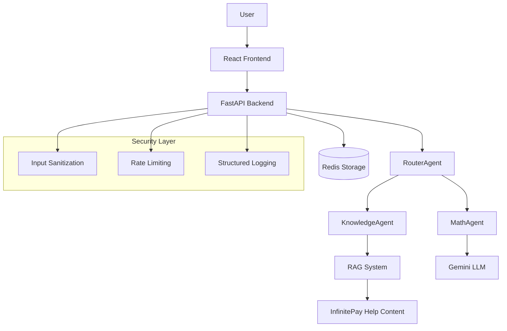

# Modular Chatbot System

A modern, production-ready chatbot system with intelligent agent routing, comprehensive security, and cloud-native deployment capabilities.

## How to Run the System Locally (Docker + docker-compose)

### Prerequisites

- Docker Engine 20.10+
- Docker Compose 2.0+
- Google Gemini API key (required, system falls back to mock agents if unavailable)

### Getting API Keys

#### Google Gemini API Key (Required)

1. Visit [Google AI Studio](https://aistudio.google.com/app/apikey)
2. Sign in with your Google account
3. Click "Create API Key"
4. Copy the generated API key
5. Add it to your `.env` file as `GEMINI_API_KEY=your_key_here`

**Note**: The system uses Gemini as the AI provider. If the API key is not provided or invalid, the system falls back to mock agents for testing.

#### Google Cloud Credentials (Required for Vertex AI)

The KnowledgeAgent uses Google Cloud Vertex AI for embeddings and chat completions. You need to set up Google Cloud credentials using a service account JSON file:

1. **Create a Google Cloud Project**:
   - Go to [Google Cloud Console](https://console.cloud.google.com/)
   - Create a new project or select an existing one
   - Enable billing for your project

2. **Enable Required APIs**:
   - Enable the **Vertex AI API**:

     ```bash
     gcloud services enable aiplatform.googleapis.com
     ```

   - Enable the **Cloud Resource Manager API**:

     ```bash
     gcloud services enable cloudresourcemanager.googleapis.com
     ```

3. **Create Service Account and Download Credentials**:
   - Create a service account:

     ```bash
     gcloud iam service-accounts create vertex-ai-user \
       --display-name="Vertex AI User"
     ```

   - Grant necessary roles:

     ```bash
     gcloud projects add-iam-policy-binding YOUR_PROJECT_ID \
       --member="serviceAccount:vertex-ai-user@YOUR_PROJECT_ID.iam.gserviceaccount.com" \
       --role="roles/ai.platform.user"
     
     gcloud projects add-iam-policy-binding YOUR_PROJECT_ID \
       --member="serviceAccount:vertex-ai-user@YOUR_PROJECT_ID.iam.gserviceaccount.com" \
       --role="roles/storage.objectViewer"
     ```

   - Create and download the service account key:

     ```bash
     gcloud iam service-accounts keys create google-credentials.json \
       --iam-account="vertex-ai-user@YOUR_PROJECT_ID.iam.gserviceaccount.com"
     ```

   - **Important**: Move the downloaded JSON file to the correct location:

     ```bash
     # For local development with Docker
     mv google-credentials.json backend/google-credentials.json
     
     # For Kubernetes deployment
     mv google-credentials.json backend/google-credentials.json
     ```

   **Note**: The `GOOGLE_APPLICATION_CREDENTIALS` environment variable is **not** needed in the `.env` file. The system automatically reads the `backend/google-credentials.json` file and extracts the project ID. For Kubernetes deployments, the credentials are automatically packaged into the deployment secrets.

**Important**: Without proper credentials in `backend/google-credentials.json`, the KnowledgeAgent will fail to initialize and the system will fall back to mock behavior.

### Quick Start

1. **Clone and setup environment**:

   ```bash
   git clone <repository>
   cd modular-chatbot
   cp .env.example .env
   # Edit .env with your Gemini API key and Google Cloud credentials
   ```

2. **Start development environment**:

   ```bash
   make dev
   ```

3. **Access the application**:
   - **Frontend**: <http://localhost:3000>
   - **Backend API**: <http://localhost:8000>
   - **API Documentation**: <http://localhost:8000/docs>

### Available Commands

#### Docker Compose Commands

```bash
make help          # Show all available commands
make dev           # Start development environment with hot reloading
make up            # Start production environment
make down          # Stop all services
make logs          # View logs from all services
make health        # Check service health
make clean         # Clean up containers and images
make test          # Run comprehensive test suite
```

#### Kubernetes Commands

```bash
make deploy        # Deploy to Kubernetes with automatic port forwarding
make deploy-no-pf  # Deploy to Kubernetes without port forwarding
make undeploy      # Remove Kubernetes deployment
make pf            # Start port forwarding only
make k8s-status    # Check Kubernetes deployment status
make k8s-logs      # Show Kubernetes pod logs
```

## How to Run on Kubernetes

### Prerequisites

- Kubernetes cluster (v1.20+)
- kubectl configured
- Docker images built and pushed to registry

### Quick Deployment

1. **Update configuration**:

   ```bash
   cd k8s
   # Edit secrets.yaml with your base64-encoded secrets
   # Edit ingress.yaml with your domain names
   ```

2. **Deploy to Kubernetes**:

   ```bash
   # Deploy with automatic port forwarding (recommended)
   make deploy
   
   # Deploy without port forwarding
   make deploy-no-pf
   
   # Alternative: Manual deployment scripts
   # Linux/macOS: ./deploy.sh
   # Windows PowerShell: ./deploy.ps1
   ```

   **Note**: The `make deploy` command automatically:
   - Builds and deploys all Kubernetes resources
   - Creates secrets from your `.env` file and `google-credentials.json`
   - Starts automatic port forwarding for local access
   - Provides immediate access to the application at:
     - Frontend: <http://localhost:3000>
     - Backend: <http://localhost:8000>

3. **Verify deployment**:

   ```bash
   kubectl get all -n modular-chatbot
   kubectl logs -f deployment/backend-deployment -n modular-chatbot
   ```

## Architecture Description

### System Overview

The system implements a modular agent-based architecture with intelligent routing:



### Core Components

#### Router

- **RouterAgent**: Intelligently analyzes incoming messages and routes them to specialized agents
- **Routing Logic**: Uses confidence scoring based on content analysis
- **Mathematical queries**: Detects operators, mathematical keywords, number patterns
- **Knowledge queries**: Identifies question words, InfinitePay-related terms, help-seeking language
- **Fallback**: Routes to KnowledgeAgent if confidence is below threshold (0.5)

#### AI Provider

The system uses Google Gemini as the primary AI provider:

1. **Google Gemini (gemini-1.5-flash model)**
   - Fast and efficient for most queries
   - Cost-effective with high rate limits
   - Excellent performance for both math and knowledge tasks
   - Free tier available with generous usage limits

2. **Mock Agents**: Used when API key is unavailable
   - Enables testing and development without API costs
   - Returns predefined responses for common query types

#### Agents

- **MathAgent**: Solves mathematical expressions using Google Gemini for interpretation
- **KnowledgeAgent**: Provides RAG-based responses using InfinitePay help content
  - Web scraping from <https://ajuda.infinitepay.io/pt-BR/>
  - Vector embeddings with Google Gemini (text-embedding-004 model)
  - FAISS for semantic search
  - Context-augmented response generation with Google Gemini

#### Logs

- **Structured JSON Format**: All logs output in consistent JSON structure
- **Performance Metrics**: Request/response times, agent processing times, confidence scores
- **Security Events**: Input sanitization, injection attempts, rate limit violations
- **Sensitive Data Masking**: Automatic masking of user IDs, conversation IDs, API keys

#### Redis

- **Conversation Storage**: Complete message history with TTL (7 days default)
- **Simplified Logging**: Structured logging system with component-based organization
- **Rate Limiting**: Distributed rate limiting with Redis-backed counters
- **User Management**: Per-user conversation tracking and retrieval
- **Health Monitoring**: Redis health checks and connection status

## How to Access the Front-end and Test Multiple Conversations

### Accessing the Frontend

1. **Start the system**: `make dev`
2. **Open browser**: Navigate to <http://localhost:3000>
3. **Verify connection**: Look for "Connected" status indicator

### Testing Multiple Conversations

1. **Create new conversation**: Click the "+" button in the sidebar
2. **Switch between conversations**: Click on conversation names in the sidebar
3. **Send different types of messages**:

   **Mathematical queries**:

   ```
   What is 65 × 3.11?
   Calculate (42 * 2) / 6
   How much is 70 + 12?
   ```

   **Knowledge queries**:

   ```
   What are the card machine fees?
   How does InfinitePay work?
   Tell me about payment processing
   ```

4. **Observe agent routing**: Each response shows which agent handled the query with confidence score
5. **Check conversation persistence**: Conversations are saved and restored between sessions

### Frontend Features

- **Responsive Design**: Works on desktop, tablet, and mobile
- **Real-time Updates**: Messages appear instantly
- **Agent Attribution**: Shows which agent responded with confidence scores
- **Conversation Management**: Create, switch, and manage multiple conversations
- **Error Handling**: Graceful handling of connection issues and failures

## Example Logs (in JSON)

### Agent Routing Log

```json
{
  "timestamp": "2025-01-17T14:32:12Z",
  "level": "INFO",
  "component": "RouterAgent",
  "conversation_id": "conv-***",
  "user_id": "user-***",
  "execution_time": 0.045,
  "message": "Routed query to KnowledgeAgent",
  "metadata": {
    "selected_agent": "KnowledgeAgent",
    "confidence": 0.92,
    "alternatives": ["MathAgent"],
    "query_type": "knowledge",
    "routing_factors": {
      "question_words": true,
      "infinitepay_terms": true,
      "math_operators": false
    }
  }
}
```

### Security Event Log

```json
{
  "timestamp": "2025-01-17T14:33:45Z",
  "level": "WARNING",
  "component": "SecurityMiddleware",
  "event_type": "input_sanitization",
  "client_ip": "192.168.1.***",
  "user_id": "us***23",
  "message": "HTML content removed from input",
  "metadata": {
    "original_length": 156,
    "sanitized_length": 142,
    "removed_tags": ["<script>", "</script>"],
    "action": "sanitized_and_allowed"
  }
}
```

### Performance Log

```json
{
  "timestamp": "2025-01-17T14:34:20Z",
  "level": "INFO",
  "component": "MathAgent",
  "conversation_id": "conv-***",
  "user_id": "user-***",
  "execution_time": 0.234,
  "message": "Mathematical query processed successfully",
  "metadata": {
    "query_complexity": "simple_arithmetic",
    "llm_response_time": 0.189,
    "validation_time": 0.012,
    "total_tokens": 45,
    "confidence": 0.98
  }
}
```

### API Request Log

```json
{
  "timestamp": "2025-01-17T14:35:10Z",
  "level": "INFO",
  "component": "RequestLoggingMiddleware",
  "method": "POST",
  "path": "/chat",
  "status_code": 200,
  "response_time": 1.456,
  "client_ip": "192.168.1.***",
  "user_agent": "Mozilla/5.0...",
  "request_id": "req_1705493710_4567",
  "message": "Request completed successfully",
  "metadata": {
    "request_size": 156,
    "response_size": 342,
    "agent_used": "KnowledgeAgent",
    "cache_hit": false
  }
}
```

## How Sanitization and Prompt Injection Protection Work

### Input Sanitization Process

1. **HTML Tag Removal**: Uses `nh3` library to remove all HTML tags and attributes
2. **Control Character Filtering**: Removes non-printable control characters
3. **Whitespace Normalization**: Standardizes whitespace and removes excessive spacing
4. **Length Validation**: Enforces maximum input length of 10,000 characters

### Prompt Injection Detection

The system detects and blocks these injection patterns:

#### Role Confusion Prevention

```python
INJECTION_PATTERNS = [
    r'system\s*:',
    r'assistant\s*:',
    r'human\s*:',
    r'user\s*:',
]
```

#### Instruction Override Detection

```python
INSTRUCTION_PATTERNS = [
    r'ignore\s+previous\s+instructions',
    r'forget\s+everything',
    r'disregard\s+the\s+above',
    r'new\s+instructions\s*:',
]
```

#### Script Injection Blocking

```python
SCRIPT_PATTERNS = [
    r'<script[^>]*>',
    r'javascript\s*:',
    r'eval\s*\(',
    r'exec\s*\(',
    r'function\s*\(',
]
```

### Security Workflow

1. **Request Reception**: All requests pass through SecurityMiddleware first
2. **Size Validation**: Check request size (1MB limit)
3. **JSON Validation**: Ensure valid JSON payload
4. **Content Sanitization**: Apply HTML removal and character filtering
5. **Injection Detection**: Scan for malicious patterns
6. **Threat Response**: Block malicious requests with generic error messages
7. **Logging**: Record all security events with masked sensitive data

### Rate Limiting

- **Chat endpoint**: 30 requests/minute per IP address
- **Health endpoint**: 100 requests/minute per IP address
- **Automatic blocking**: Requests exceeding limits receive 429 status
- **Redis-backed**: Uses Redis for distributed rate limiting

## Redis API Endpoints

The system provides several endpoints for Redis-based functionality:

### Conversation Management

- `GET /conversations/{conversation_id}` - Retrieve conversation history
- `GET /conversations/user/{user_id}` - Get all conversations for a user

### Logging System

- `GET /logs` - Retrieve logs by component and level
- `GET /logs/stats` - Get logging statistics

### Health Monitoring

- `GET /health` - System health including Redis status

### Example Usage

```bash
# Get conversation history
curl http://localhost:8000/conversations/demo-conv-123

# Get user's conversations
curl http://localhost:8000/conversations/user/user-456

# Get recent chat logs
curl http://localhost:8000/logs?component=chat&level=info&limit=50

# Get log statistics
curl http://localhost:8000/logs/stats?component=chat
```

## How to Run the Tests

### Essential Test Suite

```bash
# Run all essential tests
cd backend && python run_tests.py

# Run specific test categories
python run_tests.py router_agent  # RouterAgent decision tests
python run_tests.py math_agent    # MathAgent expression tests  
python run_tests.py end_to_end    # E2E /chat API tests

# Run with pytest directly
cd backend && python -m pytest tests/ -v
```

### Test Coverage

- **RouterAgent Decision Tests**: Routing logic and agent selection
- **MathAgent Expression Tests**: Simple mathematical expression processing
- **E2E /chat API Tests**: Complete API endpoint functionality

### Test Requirements

The test suite focuses on essential functionality:

1. **RouterAgent Decision**: Tests that the router correctly selects agents based on message content
2. **MathAgent Simple Expressions**: Tests basic mathematical expression processing  
3. **E2E /chat API**: Tests the complete API workflow from request to response

## Configuration

### Environment Variables

Create a `.env` file with:

```env
# AI API Configuration
GEMINI_API_KEY=your_gemini_api_key_here      # Required AI provider

# Optional Configuration
REDIS_URL=redis://redis:6379/0
LOG_LEVEL=INFO
ENVIRONMENT=development
CHROMA_PERSIST_DIR=./chroma_db
MAX_SCRAPE_PAGES=50
KNOWLEDGE_AGENT_TIMEOUT=30
MATH_AGENT_TIMEOUT=30
```

### API Key Setup

#### Gemini API Key (Free Tier Available)

- Visit [Google AI Studio](https://aistudio.google.com/app/apikey)
- Free tier includes generous usage limits
- No credit card required for basic usage
- Excellent performance for most use cases
- Required for the system to function properly

## Troubleshooting

### Common Issues

1. **Gemini API Key Missing**: System falls back to mock agents if Gemini API key is not provided
2. **Gemini API Key Invalid**: System falls back to mock agents if Gemini API key is invalid
3. **Port Conflicts**: Check ports 3000, 8000, 6379 availability
4. **Docker Issues**: Run `make clean && make build && make dev`
5. **Service Health**: Check with `make health`

### Debug Mode

Enable debug logging:

```bash
export LOG_LEVEL=DEBUG
# Or add LOG_LEVEL=DEBUG to .env file
```

## Support

For issues and questions:

1. Check service logs: `make logs`
2. Verify health status: `make health`
3. Review environment configuration
4. Check the troubleshooting section above
