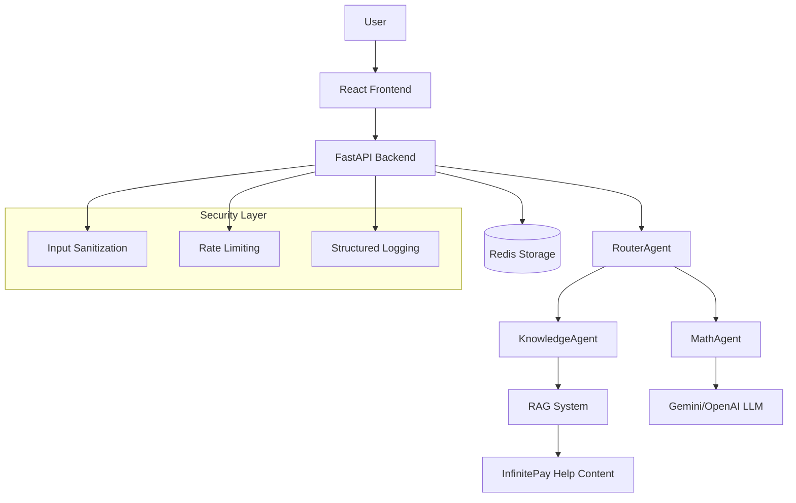

# Modular Chatbot System

A modern, production-ready chatbot system with intelligent agent routing, comprehensive security, and cloud-native deployment capabilities.

## How to Run the System Locally (Docker + docker-compose)

### Prerequisites

- Docker Engine 20.10+
- Docker Compose 2.0+
- Google Gemini API key (recommended) or OpenAI API key (optional, system works with mock agents)

### Getting API Keys

#### Google Gemini API Key (Recommended)

1. Visit [Google AI Studio](https://aistudio.google.com/app/apikey)
2. Sign in with your Google account
3. Click "Create API Key"
4. Copy the generated API key
5. Add it to your `.env` file as `GEMINI_API_KEY=your_key_here`

#### OpenAI API Key (Fallback)

1. Visit [OpenAI Platform](https://platform.openai.com/api-keys)
2. Sign in to your OpenAI account
3. Click "Create new secret key"
4. Copy the generated API key
5. Add it to your `.env` file as `OPENAI_API_KEY=your_key_here`

**Note**: The system uses Gemini as the primary AI provider and automatically falls back to OpenAI if Gemini is unavailable. If neither key is provided, the system uses mock agents for testing.

### Quick Start

1. **Clone and setup environment**:

   ```bash
   git clone <repository>
   cd modular-chatbot
   cp .env.example .env
   # Edit .env with your Gemini API key (recommended) or OpenAI API key (optional)
   ```

2. **Start development environment**:

   ```bash
   make dev
   ```

3. **Access the application**:
   - **Frontend**: <http://localhost:3000>
   - **Backend API**: <http://localhost:8000>
   - **API Documentation**: <http://localhost:8000/docs>

### Available Commands

```bash
make help          # Show all available commands
make dev           # Start development environment with hot reloading
make up            # Start production environment
make down          # Stop all services
make logs          # View logs from all services
make health        # Check service health
make clean         # Clean up containers and images
make test          # Run comprehensive test suite
```

## How to Run on Kubernetes

### Prerequisites

- Kubernetes cluster (v1.20+)
- kubectl configured
- Docker images built and pushed to registry

### Quick Deployment

1. **Update configuration**:

   ```bash
   cd k8s
   # Edit secrets.yaml with your base64-encoded secrets
   # Edit ingress.yaml with your domain names
   ```

2. **Deploy to Kubernetes**:

   ```bash
   # Linux/macOS
   ./deploy.sh
   
   # Windows PowerShell
   ./deploy.ps1
   
   # Or manually
   kubectl apply -f namespace.yaml
   kubectl apply -f configmap.yaml
   kubectl apply -f secrets.yaml
   kubectl apply -f redis-deployment.yaml
   kubectl apply -f backend-deployment.yaml
   kubectl apply -f frontend-deployment.yaml
   kubectl apply -f services.yaml
   kubectl apply -f ingress.yaml
   kubectl apply -f hpa.yaml
   ```

3. **Verify deployment**:

   ```bash
   kubectl get all -n modular-chatbot
   kubectl logs -f deployment/backend-deployment -n modular-chatbot
   ```

## Architecture Description

### System Overview

The system implements a modular agent-based architecture with intelligent routing:



### Core Components

#### Router

- **RouterAgent**: Intelligently analyzes incoming messages and routes them to specialized agents
- **Routing Logic**: Uses confidence scoring based on content analysis
- **Mathematical queries**: Detects operators, mathematical keywords, number patterns
- **Knowledge queries**: Identifies question words, InfinitePay-related terms, help-seeking language
- **Fallback**: Routes to KnowledgeAgent if confidence is below threshold (0.5)

#### AI Provider Selection

The system implements intelligent AI provider selection with automatic fallback:

1. **Primary**: Google Gemini (gemini-1.5-flash model)
   - Fast and efficient for most queries
   - Cost-effective with high rate limits
   - Excellent performance for both math and knowledge tasks

2. **Fallback**: OpenAI (GPT-4 model)
   - Activated when Gemini is unavailable or fails
   - Provides reliable backup functionality
   - Maintains service continuity

3. **Mock Agents**: Used when no API keys are available
   - Enables testing and development without API costs
   - Returns predefined responses for common query types

#### Agents

- **MathAgent**: Solves mathematical expressions using Google Gemini (primary) or OpenAI GPT-4 (fallback) for interpretation
- **KnowledgeAgent**: Provides RAG-based responses using InfinitePay help content
  - Web scraping from <https://ajuda.infinitepay.io/pt-BR/>
  - Vector embeddings with Google Gemini (primary) or OpenAI text-embedding-ada-002 (fallback)
  - ChromaDB for semantic search
  - Context-augmented response generation with intelligent AI provider selection

#### Logs

- **Structured JSON Format**: All logs output in consistent JSON structure
- **Performance Metrics**: Request/response times, agent processing times, confidence scores
- **Security Events**: Input sanitization, injection attempts, rate limit violations
- **Sensitive Data Masking**: Automatic masking of user IDs, conversation IDs, API keys

#### Redis

- **Conversation Storage**: Message history with TTL
- **Agent Metrics**: Performance tracking and caching
- **Rate Limiting**: IP-based request counting
- **Session Management**: User conversation context

## How to Access the Front-end and Test Multiple Conversations

### Accessing the Frontend

1. **Start the system**: `make dev`
2. **Open browser**: Navigate to <http://localhost:3000>
3. **Verify connection**: Look for "Connected" status indicator

### Testing Multiple Conversations

1. **Create new conversation**: Click the "+" button in the sidebar
2. **Switch between conversations**: Click on conversation names in the sidebar
3. **Send different types of messages**:

   **Mathematical queries**:

   ```
   What is 65 × 3.11?
   Calculate (42 * 2) / 6
   How much is 70 + 12?
   ```

   **Knowledge queries**:

   ```
   What are the card machine fees?
   How does InfinitePay work?
   Tell me about payment processing
   ```

4. **Observe agent routing**: Each response shows which agent handled the query with confidence score
5. **Check conversation persistence**: Conversations are saved and restored between sessions

### Frontend Features

- **Responsive Design**: Works on desktop, tablet, and mobile
- **Real-time Updates**: Messages appear instantly
- **Agent Attribution**: Shows which agent responded with confidence scores
- **Conversation Management**: Create, switch, and manage multiple conversations
- **Error Handling**: Graceful handling of connection issues and failures

## Example Logs (in JSON)

### Agent Routing Log

```json
{
  "timestamp": "2025-01-17T14:32:12Z",
  "level": "INFO",
  "component": "RouterAgent",
  "conversation_id": "conv-***",
  "user_id": "user-***",
  "execution_time": 0.045,
  "message": "Routed query to KnowledgeAgent",
  "metadata": {
    "selected_agent": "KnowledgeAgent",
    "confidence": 0.92,
    "alternatives": ["MathAgent"],
    "query_type": "knowledge",
    "routing_factors": {
      "question_words": true,
      "infinitepay_terms": true,
      "math_operators": false
    }
  }
}
```

### Security Event Log

```json
{
  "timestamp": "2025-01-17T14:33:45Z",
  "level": "WARNING",
  "component": "SecurityMiddleware",
  "event_type": "input_sanitization",
  "client_ip": "192.168.1.***",
  "user_id": "us***23",
  "message": "HTML content removed from input",
  "metadata": {
    "original_length": 156,
    "sanitized_length": 142,
    "removed_tags": ["<script>", "</script>"],
    "action": "sanitized_and_allowed"
  }
}
```

### Performance Log

```json
{
  "timestamp": "2025-01-17T14:34:20Z",
  "level": "INFO",
  "component": "MathAgent",
  "conversation_id": "conv-***",
  "user_id": "user-***",
  "execution_time": 0.234,
  "message": "Mathematical query processed successfully",
  "metadata": {
    "query_complexity": "simple_arithmetic",
    "llm_response_time": 0.189,
    "validation_time": 0.012,
    "total_tokens": 45,
    "confidence": 0.98
  }
}
```

### API Request Log

```json
{
  "timestamp": "2025-01-17T14:35:10Z",
  "level": "INFO",
  "component": "RequestLoggingMiddleware",
  "method": "POST",
  "path": "/chat",
  "status_code": 200,
  "response_time": 1.456,
  "client_ip": "192.168.1.***",
  "user_agent": "Mozilla/5.0...",
  "request_id": "req_1705493710_4567",
  "message": "Request completed successfully",
  "metadata": {
    "request_size": 156,
    "response_size": 342,
    "agent_used": "KnowledgeAgent",
    "cache_hit": false
  }
}
```

## How Sanitization and Prompt Injection Protection Work

### Input Sanitization Process

1. **HTML Tag Removal**: Uses `bleach` library to remove all HTML tags and attributes
2. **Control Character Filtering**: Removes non-printable control characters
3. **Whitespace Normalization**: Standardizes whitespace and removes excessive spacing
4. **Length Validation**: Enforces maximum input length of 10,000 characters

### Prompt Injection Detection

The system detects and blocks these injection patterns:

#### Role Confusion Prevention

```python
INJECTION_PATTERNS = [
    r'system\s*:',
    r'assistant\s*:',
    r'human\s*:',
    r'user\s*:',
]
```

#### Instruction Override Detection

```python
INSTRUCTION_PATTERNS = [
    r'ignore\s+previous\s+instructions',
    r'forget\s+everything',
    r'disregard\s+the\s+above',
    r'new\s+instructions\s*:',
]
```

#### Script Injection Blocking

```python
SCRIPT_PATTERNS = [
    r'<script[^>]*>',
    r'javascript\s*:',
    r'eval\s*\(',
    r'exec\s*\(',
    r'function\s*\(',
]
```

### Security Workflow

1. **Request Reception**: All requests pass through SecurityMiddleware first
2. **Size Validation**: Check request size (1MB limit)
3. **JSON Validation**: Ensure valid JSON payload
4. **Content Sanitization**: Apply HTML removal and character filtering
5. **Injection Detection**: Scan for malicious patterns
6. **Threat Response**: Block malicious requests with generic error messages
7. **Logging**: Record all security events with masked sensitive data

### Rate Limiting

- **Chat endpoint**: 30 requests/minute per IP address
- **Health endpoint**: 100 requests/minute per IP address
- **Automatic blocking**: Requests exceeding limits receive 429 status
- **Redis-backed**: Uses Redis for distributed rate limiting

## How to Run the Tests

### Comprehensive Test Suite

```bash
# Run all tests (backend + frontend)
make test

# Backend tests only
cd backend && python -m pytest tests/ -v

# Frontend tests only
cd frontend && npm test

# Specific test categories
cd backend && python -m pytest tests/test_security.py -v    # Security tests
cd backend && python -m pytest tests/test_integration.py -v # Integration tests
cd backend && python -m pytest tests/test_performance.py -v # Performance tests
```

### Individual Test Scripts

```bash
# Simple security verification
cd backend && python test_security_simple.py

# API integration testing
python test_api.py

# Knowledge agent testing
python test_knowledge_agent_integration.py

# Math agent testing
python test_math_agent_integration.py

# Frontend integration testing
node test_frontend_integration.js
```

### Docker-based Testing

```bash
# Test in containerized environment
docker-compose exec backend pytest tests/ -v
docker-compose exec frontend npm test -- --run

# Test with fresh containers
make clean
make build
make test
```

### Test Categories

#### Security Tests

- Input sanitization validation
- Prompt injection detection
- Rate limiting functionality
- Error handling security

#### Integration Tests

- End-to-end API workflows
- Agent routing accuracy
- Database connectivity
- External service integration

#### Performance Tests

- Response time benchmarks
- Concurrent request handling
- Memory usage validation
- Rate limiting effectiveness

#### Unit Tests

- Individual component functionality
- Agent logic validation
- Utility function testing
- Data model validation

### Test Results Interpretation

Tests provide detailed output including:

- **Pass/Fail Status**: Clear indication of test results
- **Performance Metrics**: Response times and resource usage
- **Security Validation**: Confirmation of security measures
- **Coverage Reports**: Code coverage statistics
- **Error Details**: Specific failure information for debugging

## Configuration

### Environment Variables

Create a `.env` file with:

```env
# AI API Configuration (at least one required)
GEMINI_API_KEY=your_gemini_api_key_here      # Primary AI provider (recommended)
OPENAI_API_KEY=your_openai_api_key_here      # Fallback AI provider (optional)

# Optional Configuration
REDIS_URL=redis://redis:6379/0
LOG_LEVEL=INFO
ENVIRONMENT=development
CHROMA_PERSIST_DIR=./chroma_db
MAX_SCRAPE_PAGES=50
KNOWLEDGE_AGENT_TIMEOUT=30
MATH_AGENT_TIMEOUT=30
```

### API Key Setup

#### Gemini API Key (Free Tier Available)
- Visit [Google AI Studio](https://aistudio.google.com/app/apikey)
- Free tier includes generous usage limits
- No credit card required for basic usage
- Excellent performance for most use cases

#### OpenAI API Key (Paid Service)
- Visit [OpenAI Platform](https://platform.openai.com/api-keys)
- Requires payment setup
- Used as fallback when Gemini is unavailable
- Optional but recommended for production environments

## Troubleshooting

### Common Issues

1. **AI API Keys Missing**: System falls back to mock agents if neither Gemini nor OpenAI keys are provided
2. **Gemini API Key Invalid**: System automatically falls back to OpenAI if available
3. **Port Conflicts**: Check ports 3000, 8000, 6379 availability
4. **Docker Issues**: Run `make clean && make build && make dev`
5. **Service Health**: Check with `make health`

### Debug Mode

Enable debug logging:

```bash
export LOG_LEVEL=DEBUG
# Or add LOG_LEVEL=DEBUG to .env file
```

## Support

For issues and questions:

1. Check service logs: `make logs`
2. Verify health status: `make health`
3. Review environment configuration
4. Check the troubleshooting section above
